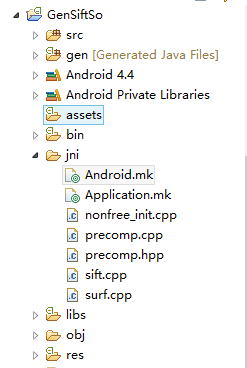

# GDesign readme

---

This is an Android application using machine learning algorithms to do images classificaiton。
#Bag of words
The bag-of-words model is a simplifying representation used in natural language processing(NLP) and information retrieval(IR).An Imagin can be treated as document by extracting its feature vector by some computer vision algorithms(here using SIFT).We can see that imagins to be classified all be translated to "bag of visual worlds"(128 dimension vector).

(Find more at http://en.wikipedia.org/wiki/Bag-of-words_model_in_computer_vision)
#Configration
###SIFT Dependency(Generate SIFT Dynamically Loaded Library)
Files Organization:

Android.mk

    LOCAL_PATH:= $(call my-dir)
    include $(CLEAR_VARS)
    OPENCV_INSTALL_MODULES:=on
    OPENCV_CAMERA_MODULES:=off
    include ~\OpenCV-2.4.7-android-sdk\sdk\native\JNI\OpenCV.mk
    LOCAL_C_INCLUDES:=~\OpenCV-2.4.7-android-sdk\sdk\native\JNI\include
    LOCAL_MODULE    := nonfree
    LOCAL_CFLAGS    := -Werror -O3 -ffast-math
    LOCAL_LDLIBS    += -llog
    LOCAL_SRC_FILES := nonfree_init.cpp \
    precomp.cpp \ 
    sift.cpp \
    surf.cpp
    include $(BUILD_SHARED_LIBRARY)
Application.mk

    APP_ABI := armeabi-v7a//ARMv7 architecture CPU
    APP_STL := gnustl_static
    APP_CPPFLAGS := -frtti -fexceptions
    APP_PLATFORM := android-8
Multicore optimization
Today more and more mobile devices feature multi-core processors.on  Which Java threadPool can be used to develop parallel computing。
ExtractSiftFea.java:

    ExecutorService fixedThreadPool = Executors.newFixedThreadPool(4);
    for (int i = 0; i < fileInfos.length; i++) {
    	final String file_path=pho_paths[i];
    	fixedThreadPool.execute(new Runnable(){
    		@Override
    		public void run() {
    			System.out.println("Thread begin!");
    			GeaFeaFile(file_path);
    		}
    	});
    }
    fixedThreadPool.shutdown();

#Some results

